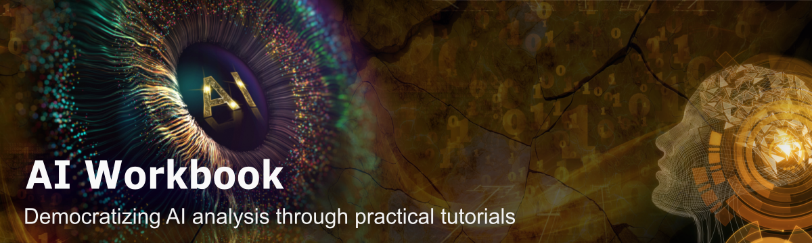



[DataScience Workbook](https://datascience.101workbook.org/) / [01. Introduction to Data Science](00-IntroToDataScience-LandingPage.md) / [2. Applications of Computational Science](02-computational-science-applications.md) / **2.3 Machine Learning Outlook**

---

# Introduction

**Machine learning** is a subfield of artificial intelligence that involves the use of **algorithms to automatically learn patterns in data** and make decisions or predictions based on that data. In other words, machine learning algorithms are designed to improve their performance on a specific task as they are exposed to more data.

There are many different types of machine learning algorithms, including:
* supervised learning algorithms, *trained on labeled data, where the correct output is provided for each example in the training set*
* unsupervised learning algorithms, *trained on unlabeled data; try to find patterns or relationships in the data without being told what those patterns are*
* and reinforcement learning algorithms, *involve training an agent to take actions in an environment in order to maximize a reward*

**Artificial intelligence** (AI) is a broader field that includes machine learning as well as other **techniques for achieving intelligent behavior in computers**. AI enables creating systems that can perform tasks that typically require human-like intelligence, such as understanding natural language, recognizing objects and scenes, and making decisions based on incomplete or uncertain information.

## Areas of applications

There are many applications of artificial intelligence (AI) and machine learning, ranging from <u>simple tasks</u> such as **image or speech recognition** to more <u>complex tasks</u> such as **autonomous decision-making and problem-solving**. The potential for these technologies is vast and continues to expand as the field evolves. Some current applications of AI and machine learning in the real world include:

<table>
  <tr> <th>Artificial Intelligence has a wide range of applications, including:</th> <th></th> </tr>
  <tr> <td>
        <b>General:</b> 
        <li> image and speech recognition </li>
        <li> natural language processing </li>
        <li> predictive analytics using historical data </li>
         
        <b>Field-specific:</b> 
        <li> computer vision: autonomous vehicles and robots </li>
        <li> healthcare: assist with diagnosis </li>
        <li> finance: prevent fraudulent activity </li>
        <li> customer service: chatbots and virtual assistants </li>
        <li> manufacturing: identify inefficiencies, prevent accidents </li>
    </td> <td>
         
          <i>The figure shows the applications of the Artificial Intelligence.</i>
    </td> </tr>
</table>

## AI Workbook

Machine learning methods are increasingly being used in scientific research across a wide range of fields, including **biology**, physics, astronomy, **geospatial**, and many others. The novel AI-based approaches has several advantages, including the **ability to analyze large amounts of data quickly and accurately**, the ability to **identify patterns and relationships in data** that may not be immediately obvious to human researchers, and the ability to **make predictions** based on those patterns.

1. One example of the use of machine learning in Sequencing Bioinformatics to identify patterns in large datasets of genomic data and predict the function of specific genes in various biological processes.

2. Another example in Structural Bioinformatics is the use of AI-based AlphaFold software to analyze the sequence of proteins and predict their three-dimensional structure, which can help researchers design new drugs that target specific proteins.

3. Machine learning algorithms can be also used in geospatial analysis analyze and interpret data from satellite imagery and other geospatial data sources. Once trained, they make predictions about things like land use, crop yields, and environmental changes. *For example, machine learning algorithms can be used to analyze satellite imagery of forests to identify areas that are at risk of deforestation or to predict the potential yield of a crop field based on its location and other factors.*

One effective way to learn about AI applications is to study examples of real-world problems that are solved using computational tools and machine learning algorithms. The <a href="https://ai.101workbook.org" target="_blank">AI Workbook  ⤴</a>, available at <a href="https://ai.101workbook.org" target="_blank">https://ai.101workbook.org  ⤴</a>, is a useful resource for this purpose, as it provides a comprehensive overview of various aspects of **applying machine learning methods** in challenging tasks of scientific research. By working through these practical examples, readers can gain a deeper understanding of how AI techniques are used to for tasks that involve analyzing large amounts of data, identifying patterns and relationships in the data, and making predictions based on those patterns.

#### Learn more...

0. <a href="https://ai.101workbook.org" target="_blank">AI Workbook - homepage  ⤴</a>
1. <a href="https://ai.101workbook.org/about.html" target="_blank">About the AI Workbook  ⤴</a>
2. <a href="https://ai.101workbook.org/list.html" target="_blank">Detailed Table of Content  ⤴</a>
3. <a href="https://ai.101workbook.org/glossary.html" target="_blank">AI Glossary  ⤴</a>
4. <a href="https://ai.101workbook.org/Contributing.html" target="_blank">How to contribute?  ⤴</a>

___
# Further Reading
* [SECTION 2. Introduction to the Command Line](../02-IntroToCommandLine/00-IntroToCommandLine-LandingPage)

___

[Homepage](../index.md){: .btn  .btn--primary}
[Section Index](00-IntroToDataScience-LandingPage){: .btn  .btn--primary}
[Previous](02B-geospatial-analytics){: .btn  .btn--primary}
[Next](../02-IntroToCommandLine/00-IntroToCommandLine-LandingPage){: .btn  .btn--primary}
[top of page](#introduction){: .btn  .btn--primary}
