

[DataScience Workbook](https://datascience.101workbook.org/) / [04. Development Environment](00-DevelopmentEnvironment-LandingPage.md) / [2. Python programming environment(s)](02-python-programming-environment.md) / **2.2 Online Notebook: interactive Python code on Try-jupyter and Colab**

---


<span style="color: #ff3870;font-weight: 500;">NOTE:</span> <i>Please note that this tutorial requires the user to have a basic understanding of the options available in Jupyter. If you are not familiar with Jupyter, we recommend exploring other tutorials in section <a href="https://datascience.101workbook.org/04-DevelopmentEnvironment/00-DevelopmentEnvironment-LandingPage" target="_blank">04. Development Environment  ⤴</a> to get started:</i>
* <a href="https://datascience.101workbook.org/04-DevelopmentEnvironment/01B-jupyter-basics" target="_blank">Jupyter: Interactive Web-Based Multi-Kernel DE  ⤴</a>
* <a href="https://datascience.101workbook.org/04-DevelopmentEnvironment/01B-tutorial-jupyter-lab" target="_blank">Getting Started with JupyterLab on a local machine  ⤴</a>
* <a href="https://datascience.101workbook.org/04-DevelopmentEnvironment/01B-tutorial-jupyter-notebook" target="_blank">Getting Started with Jupyter Notebook on HPC systems  ⤴</a>


# Introduction

The `.ipynb` file format stands for ***IPython Notebook***, which was the original name of Jupyter Notebook. This file format allows users to create and share interactive documents that contain:
* live code,
* equations,
* visualizations, and
* narrative text (*documentation, comments*).

Notebooks can be used for a wide range of purposes, including data exploration, data visualization, machine learning, and scientific research.

Notebooks consist of a series of cells, which can be either `code cells` or `markdown/text cells`.
* **Code cells** contain executable code in the programming language of your choice (e.g. *Python, R, Julia*, etc.). The code cells can be executed in the notebook, allowing you to see the output of your code and visualize your data in real time.

* **Markdown cells** contain formatted text and equations written in *Markdown* or *LaTeX*. The markdown cells can be rendered in the notebook, providing the project description in the user-friendly way.

* **Output cells** is typically displayed in a separate cell below the input cell. This separation allows for a cleaner and more organized presentation of the code and its results. The output cells can contain interactive plots, graphical components, and dynamic visualizations. These output cells can be hidden or shown at will by the user.

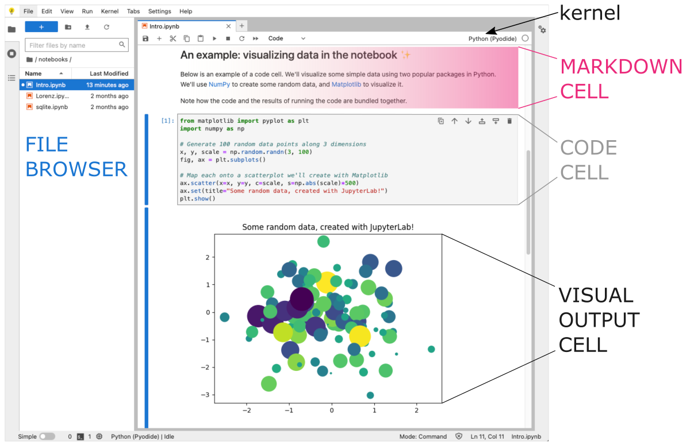

Notebooks can be easily shared as a `.ipynb` file or hosted on online platforms (e.g., <a href="https://colab.research.google.com/" target="_blank">Google Colab  ⤴</a>), **allowing collaborators to access and modify the same document in real-time**, which streamlines collaboration and helps to reduce errors and redundancies.


## *Online Notebook Platforms*

There are several online options to create a `.ipynb` notebook:

* **Try-Jypyter platform** <a href="https://jupyter.org/try" target="_blank">https://jupyter.org/try  ⤴</a> <br>
<i>Jupyter Try is a web-based platform that allows users to try out Jupyter notebooks without having to install anything locally. It provides access to a virtual machine that comes pre-installed with the Jupyter Notebook environment and a selection of popular scientific libraries.</i>

* **Google Colab** <a href="https://colab.research.google.com/" target="_blank">https://colab.research.google.com/  ⤴</a> <br>
<i>Google Colab is a free Jupyter Notebook environment provided by Google that allows you to write and execute Python code in the cloud. It comes with pre-installed libraries and supports GPU acceleration for machine learning workloads.</i>

* **Microsoft Azure** <a href="https://notebooks.azure.com/" target="_blank">https://notebooks.azure.com/  ⤴</a> <br>
<i>Microsoft Azure provides a cloud computing platform and a variety of services, including Azure Notebooks, which allows users to create and share Jupyter-like notebooks in the cloud.</i>

* **IBM Watson Studio** <a href="https://www.ibm.com/cloud/watson-studio" target="_blank">https://www.ibm.com/cloud/watson-studio  ⤴</a> <br>
<i>IBM Watson Studio is a cloud-based data science platform that provides a suite of tools for building, training, and deploying machine learning models. It includes a Jupyter Notebook environment, as well as data preparation tools, model development tools, and deployment tools.</i>

* **Kaggle Kernels** <a href="https://www.kaggle.com/kernels" target="_blank">https://www.kaggle.com/kernels  ⤴</a> <br>
<i>Kaggle Kernels is a cloud-based environment for creating, running, and sharing data science projects. It supports Jupyter Notebook and RStudio, and provides access to a variety of datasets, pre-installed libraries, and GPU resources.</i>

* **Databricks** <a href="https://community.cloud.databricks.com/login.html" target="_blank">https://community.cloud.databricks.com/login.html  ⤴</a> <br>
<i>Databricks is a cloud-based data analytics platform that provides a collaborative environment for data scientists, data engineers, and business analysts. It supports Jupyter Notebook, as well as SQL, streaming, and machine learning workloads.</i>


## *Is Python in an online notebook always good?*

Online notebooks can be a **great tool for interactive data analysis and collaboration.**

<span style="font-size: 24px; font-weight: 600; color: #66cb5e; ">✓</span> The notebook `.ipynb` is primarily designed for **interactive computing, data exploration, and rapid prototyping**, making it an excellent tool for tasks like data analysis, data visualization, and machine learning.

<span style="font-size: 24px; font-weight: 600; color: #66cb5e; ">✓</span> Online notebooks can be **accessed from any computer with an internet connection**, allowing you to work from anywhere.

<span style="font-size: 24px; font-weight: 600; color: #66cb5e; ">✓</span> Online notebooks make it **easy to collaborate** with others in real time, as multiple users can edit the same notebook simultaneously.

<span style="font-size: 24px; font-weight: 600; color: #66cb5e; ">✓</span> Many online notebook platforms **come with pre-installed libraries**, making it easy to get started with data analysis and machine learning.

<span style="font-size: 24px; font-weight: 600; color: #66cb5e; ">✓</span> Some online notebook platforms **offer access to high-performance hardware resources like GPUs and TPUs**, which can speed up machine learning workloads.
<br><br>

While online notebooks can be a convenient and accessible way to work with Python, there are some potential drawbacks to consider:

<span style="font-size: 24px; font-weight: 600; color: #df0010; ">✗</span> For **small Python scripts** or **large modular Python developments** a plain text file script `.py` or IDEs such as Visual Studio Code (VSC) or PyCharm are often a better choice than Jupyter, since they offer more advanced features, like debugging, refactoring, and testing, that are essential for professional development.

<span style="color: #ff3870;font-weight: 500;">Learn more from the practical tutorials: <br>
- <a href="https://datascience.101workbook.org/04-DevelopmentEnvironment/02C-python-text-editor" target="_blank">Text editors: create Python code in terminal text files   ⤴</a> <br>
- <a href="https://datascience.101workbook.org/04-DevelopmentEnvironment/02E-python-pycharm-ide" target="_blank">PyCharm: IDE for Professional Python Developers  ⤴</a></span>

<span style="font-size: 24px; font-weight: 600; color: #df0010; ">✗</span> Online notebooks may not provide as much flexibility and customization as locally-installed versions of Jupyter. This can be a **limitation if you need to install specific libraries** or modify the environment in other ways.

<span style="font-size: 24px; font-weight: 600; color: #df0010; ">✗</span> Depending on the complexity of your code and the amount of data you're working with, online notebooks **may be slower to execute** than a local installation of Python.

<span style="font-size: 24px; font-weight: 600; color: #df0010; ">✗</span> Working with sensitive data in an online notebook can pose security risks, as the data may be stored on a remote server that you don't control. *It's important to carefully consider the security implications of using online notebooks, and to take appropriate precautions to protect your data.*

<span style="font-size: 24px; font-weight: 600; color: #df0010; ">✗</span> Some online notebook platforms **require a subscription or incur charges** for access to additional resources, which may be an issue for those working on a tight budget.


---

# *try-jupyter* **online**

The Jupyter Project offers an **online training platform** called <i>"Try Jupyter"</i> that allows users to **get started with Python projects in Jupyter** without having to install any software on their own computer.

The <a href="https://jupyter.org/try-jupyter/lab/" target="_blank">Try Jupyter ⤴</a> online coding platform provides Python kernel with the <a href="https://pyodide.org/en/stable/" target="_blank">Pyodide  ⤴</a> distribution.

<div style="background: #dff5b3; padding: 15px;">
<span style="font-weight:800;">NOTE:</span>
<br><span style="font-style:italic;">
<b>Pyodide is a Python runtime environment that runs entirely in the browser using WebAssembly</b>. It includes the Python interpreter, standard library <i>(<a href="https://pyodide.org/en/stable/usage/wasm-constraints.html" target="_blank">limited modules only  ⤴</a>)</i>, and a number of third-party libraries (e.g., numpy, pandas, scipy, scikit-learn, matplotlib, pillow, and <a href="https://pyodide.org/en/stable/usage/packages-in-pyodide.html" target="_blank">more  ⤴</a>), all of which can be used directly <b>in the browser without requiring any installation</b> or setup. Pyodide was developed by Mozilla and is part of the larger WebAssembly project.
</span>
</div><br>

## *PROS & CONS*

<span style="font-size: 24px; font-weight: 600; color: #66cb5e; ">✓</span> A good option to quickly see if working in JupyterLab is for you. <br>
<span style="font-size: 24px; font-weight: 600; color: #66cb5e; ">✓</span> You don't even need to install Jupyter Lab, all you need is an Internet connection. <br>
<span style="font-size: 24px; font-weight: 600; color: #66cb5e; ">✓</span> Most useful libraries are available without additional installation. <br>
<span style="font-size: 24px; font-weight: 600; color: #66cb5e; ">✓</span> You don't need an account or to sign in. Just open the jupyter-try and start using it! <br>
<span style="font-size: 24px; font-weight: 600; color: #df0010; ">✗</span> You can't install custom libraries. <br>
<span style="font-size: 24px; font-weight: 600; color: #df0010; ">✗</span> You can't easily load files from your local file system <i>(<a href="https://developer.mozilla.org/en-US/docs/Learn/Common_questions/Tools_and_setup/set_up_a_local_testing_server#running_a_simple_local_http_server" target="_blank">running a simple local HTTP server  ⤴</a> is required)</i> <br>
<span style="font-size: 24px; font-weight: 600; color: #df0010; ">✗</span> You can't easily load data files and images from online resources. <br>

## Get started on a platform

**Here's how you can use the platform:**

**1.** Open any web browser and go to the Try Jupyter website: <a href="https://jupyter.org/try" target="_blank">https://jupyter.org/try  ⤴</a>

**2.** Click on the `Try` button in the top menu bar and then click on the `Try JupyterLab` section, to launch the Jupyter user interface in your browser.

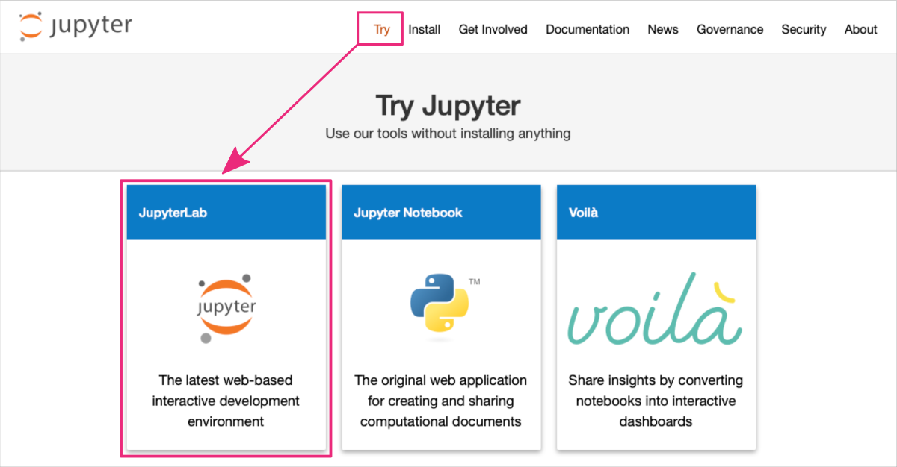

*Wait for the platform to load. This may take a few moments.*

**3.** Once the platform has loaded, you should be redirected to the URL: <a href="https://jupyter.org/try-jupyter/lab/" target="_blank">https://jupyter.org/<b>try-jupyter</b>/lab/  ⤴</a>. Now, you can start a new notebook:
* using the Launcher shortcuts by clicking on the `Python (Pyodide)` button in the **Notebook** section

or
* using the top menu bar: `File : New : Notebook ` and selecting `Python (Pyodide)` from the drop-down menu.

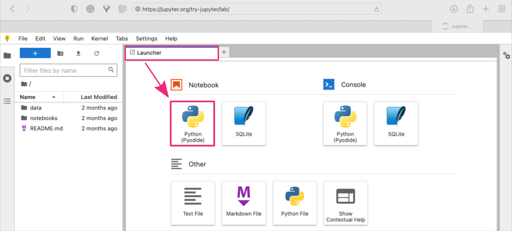

*The new notebook should appear as a new tab in your JupyterLab interface.*

**4.** You can rename the notebook file by double clicking on the filename in the `File browser` panel on the left-hand side. *My notebook is called `scatterplot.ipynb`.*

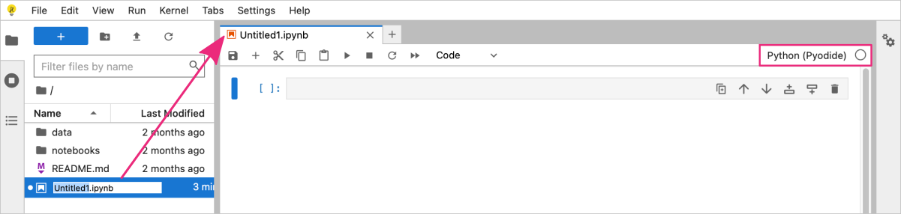

You can now start writing Python code in the notebook cells and running them by clicking on the `Run` button in the top menu bar or pressing `Shift + Enter` to run the current cell and select the cell below it.

## Python coding example <br> <i>- scatterplot by <b>matplotlib</b></i>

**5. Example Python-based notebook for creating scatterplot using matplotlib.**

<i>In this example, we create the set of 100 random 3-dimensional points using `numpy` library. Then we will use a `matplotlib` functions to plot the dataset as a 2-dimensional scatterplot with a third dimension determining the size of the points.</i>

<div style="background: #dff5b3; padding: 15px;">
<span style="font-weight:800;">NOTE:</span>
<br><span style="font-style:italic;">
<a href="https://numpy.org/" target="_blank">NumPy  ⤴</a> is a Python library for numerical computing that includes a <a href="https://numpy.org/doc/stable/reference/random/index.html" target="_blank">random  ⤴</a> module for generating random numbers and arrays. <br><br>
<a href="https://matplotlib.org" target="_blank">Matplotlib  ⤴</a> is a popular data visualization library for Python. It provides a wide range of tools for creating different types of plots, including line plots, scatter plots, bar plots, histograms, and more.
</span>
</div><br>

Both libraries are included within the Pyodide distribution, so no installations are required.

**STEP A: Add a markdown cell in the notebook providing the introduction to your project.**

*You can copy the text provided below and paste it into the first cell in the notebook.*

<div style="background: #e8e9e8; padding: 15px;">
# Python-based ScatterPlot <br>
In this project, we will explore the use of: <br>
* `matplotlib`, a Python data visualization library, to create a scatterplot <br>
* `random` module of the `numpy` library, to generate a dataset for plotting, composed of 100 3-dimensional points. <br><br>

*Through this exercise, we aim to showcase the potential of these powerful tools in effectively representing and visualizing complex data sets. By leveraging the capabilities of Matplotlib and Numpy, we hope to provide insights into the relationships and patterns that can be inferred from the given dataset.*
</div><br>

Now, change the cell type from `code` to `markdown` in the top menu bar in the notebook section.

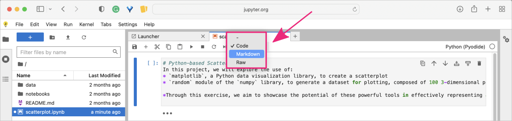

<div style="background: #cff4fc; padding: 15px;">
<span style="font-weight:800;">PRO TIP:</span>
<br><span style="font-style:italic;">
To learn more about Markdown syntax and benefits, check out the practical tutorial <a href="https://datascience.101workbook.org/09-ProjectManagement/02-DOCUMENTATION/02-intro-to-markdown" target="_blank">Introduction to Markdown  ⤴</a> in Section <a href="https://datascience.101workbook.org/09-ProjectManagement/02-DOCUMENTATION/01-documentation-improvement-tools" target="_blank">09. Project Management : Documentation Improvement Tools  ⤴</a>. It will provide you with a hands-on experience of using Markdown to format text, add images, create lists, and more. Don't miss out on this opportunity to enhance your skills!
</span>
</div><br>

To execute the cell press `Alt + Enter` ( use `option + return` for macOS ). <br>
*This will render the markdown content and add a new cell below. By default, new cells are always of the `code` type.*

**STEP B: Add a code cell to import required modules.**

In the next cell add Python code for all required imports, i.e., `numpy` and `matplotlib`.

```
# import modules
import numpy as np                        # to generate random dataset
from matplotlib import pyplot as plt      # to create scatterplot
```

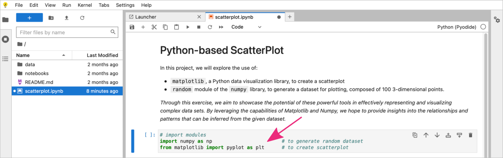

To execute the code cell, again press `Alt + Enter` ( use `option + return` for macOS ).

**STEP C: Add a code cell to create the python code.**

In the next `code cell` add Python code for generating the dataset and creating the scatterplot.

```
#1 Generate 100 random data points along 3 dimensions
x, y, scale = np.random.randn(3, 100)

#2 Create a scatter plot
fig, ax = plt.subplots()

#3 Add dataset to the scatterplot
ax.scatter(x=x, y=y, c=scale, s=np.abs(scale)*500)

#4 Add labels and title
ax.set_xlabel('X Label')
ax.set_ylabel('Y Label')
ax.set(title="Some random data, created with JupyterLab!")

#5 Show the scatterplot
plt.show()
```

<details><summary><i><b>What the script does?</b></i></summary>

<b>#1 Generate 100 random data points along 3 dimensions</b><br>
The numpy libarary includes a random module. One of the functions provided by <b>numpy.random</b> is <i>randn()</i>. This function generates an array of random numbers that are drawn from a standard normal distribution. The arguments of the function determine the the shape of the generated array.
<code style="background-color: #e4f0f0; padding: 10px 10px; width:100%; display: block; margin-top: 10px; font-size:0.8em;">
x, y, scale = np.random.randn(3, 100)
</code><br>
<i>In this example we create a 2D array with 3 rows ('x', 'y', 'scale') and 100 columns containing random numbers. We split the array by row dimension into three separate objects. By organizing the data in this way, we can easily manipulate the points coordinates ('x' and 'y') and scale their size. </i>
<br><br>
<b>#2 Create a scatter plot</b><br>
Matplotlib library creates a figure that can contain one or more subplots within it.
<div style="background: #dff5b3; padding: 15px;">
<span style="font-weight:800;">NOTE:</span>
<br><span style="font-style:italic;">Subplots are essentially smaller plots within a larger plot, which can be useful for visualizing multiple sets of data or for creating more complex visualizations.</span>
</div><br>
The plt.subplots() function returns two values: a figure object (fig) and an array of axes objects (ax).
<code style="background-color: #e4f0f0; padding: 10px 10px; width:100%; display: block; margin-top: 10px; font-size:0.8em;">
fig, ax = plt.subplots()
</code><br>
The figure object represents the entire plot, while the axes objects represent the individual subplots within the plot. When no arguments are provided, a single subplot is created by applying the default settings <b>plt.subplots(nrows=1, ncols=1)</b>.
<br><br>
<b>#3 Add dataset to the scatterplot</b><br>
<b>ax.scatter()</b> is a function in the Matplotlib library that is used to create a scatter plot. It takes in a set of x and y coordinates, along with some optional arguments, and plots them as individual points on a 2D plane. The basic syntax for ax.scatter() is as follows: <br>
<code style="background-color: #e4f0f0; padding: 10px 10px; width:100%; display: block; margin-top: 10px; font-size:0.8em;">
ax.scatter(x, y, s=None, c=None, marker=None, cmap=None, alpha=None)
</code>
<i>where:</i>
<li><b>x</b> is a sequence of x coordinates for the points to be plotted</li>
<li><b>y</b> is a sequence of y coordinates for the points to be plotted</li>
<li><b>c</b> is the color of the markers</li>
    <i>&emsp;This can be a single color, or a sequence of colors that correspond to each point in the plot.</i>
<li><b>s</b> is the size of the markers (points) in the scatter plot</li>
    <i>&emsp;This can be a scalar value, or a sequence of values that correspond to each point in the plot.</i>
<li><b>marker</b> is the shape of the markers</li>
    <i>&emsp;This can be a string specifying a built-in marker shape (e.g., 'o' for circles), or a custom marker object.</i>
<li><b>cmap</b> is a colormap object that maps the "c" values to a range of colors</li>
<li><b>alpha</b> is the transparency of the markers</li> <br>
<i>In this example, we use arrays of random values to set XY coordinates of the points and determine numerical range mapped to the default colorscale. The size of the points is the scale array transformed to absolute values using np.abs() function and multiplied by 500 to provide intiger sizes in range from 1 to 500.</i>
<br><br>
<b>#4 Add labels and title</b><br>
In Matplotlib, the <b>ax</b> object is a reference to the axis of a plot. It provides various functions that can be used to customize the scatterplot and other types of plots.<br><br>
For a scatterplot created using the ax.scatter() function, some of the common functions that can be used to customize the plot include:
<li><b>ax.set_xlabel()</b> sets the x-axis label for the scatterplot</li>
<li><b>ax.set_ylabel()</b> sets the y-axis label for the scatterplot</li>
<li><b>ax.set_title()</b> sets the title of the scatterplot</li>
<li><b>ax.set_xlim()</b> sets the limits of the x-axis for the scatterplot</li>
<li><b>ax.set_ylim()</b> sets the limits of the y-axis for the scatterplot.</li>
<br>
<b>#5 Show the scatterplot</b><br>
In Matplotlib, <b>plt.show()</b> is a function that displays all currently active figures. When you call plt.show(), Matplotlib will display any previously created plots that have not yet been shown.<br>
<div style="background: #cff4fc; padding: 15px;">
<span style="font-weight:800;">PRO TIP:</span>
<br><span style="font-style:italic;">
The <b>plt.show() function should typically be called at the end of the code block</b> that creates a plot. This is because, until the plt.show() function is called, Matplotlib will hold the plot in memory, but won't display it. This allows you to create multiple plots in a single script or code block and display them all at once.
</span>
</div>
</details><br>

To execute the code cell, again press `Alt + Enter` ( use `option + return` for macOS ).

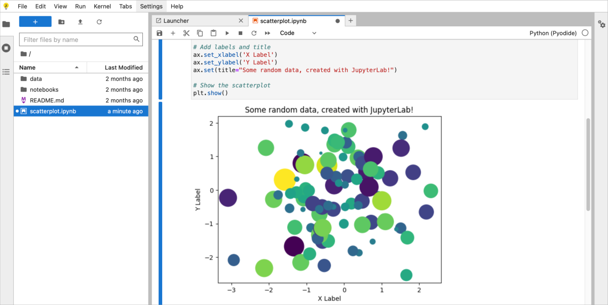

<div style="background: #cff4fc; padding: 15px;">
<span style="font-weight:800;">PRO TIP:</span>
<br><span style="font-style:italic;">
When you execute a code cell, the output generated by that cell is displayed below the code. If you want to modify the code, you can simply click on the cell and make changes to the code. Once you've made the desired changes, you can execute the cell again by clicking on the "Run" button, or by using the keyboard shortcut <i>Shift + Enter</i> or <i>Alt + Enter</i>.
</span>
</div><br>

<p align="center">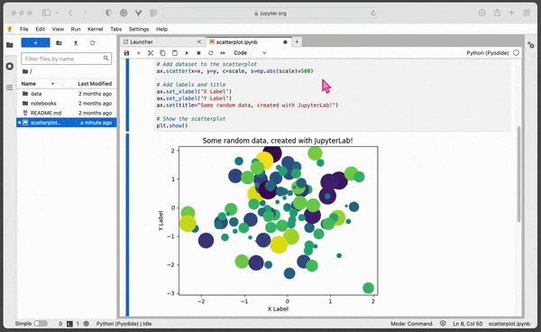</p>

<div style="background: #cff4fc; padding: 15px;">
<span style="font-weight:800;">PRO TIP:</span>
<br><span style="font-style:italic;">
By editing and re-running cells, you can quickly test different variations of your code and see how they affect the output. This can be particularly useful if you want to explore different parameters or settings for your code. <br><br>
In addition to editing and re-running cells, you can also add new cells to your notebook to test out different options. This way, you can easily compare the results of different versions of your code side-by-side.
</span>
</div><br>

After completing your work in the <b>try-jupyter</b> notebook, you may wish to download it for either personal reference or to share with others. To do this, simply select `File` from the top menu, and then choose `Download` to obtain a local copy of the notebook.

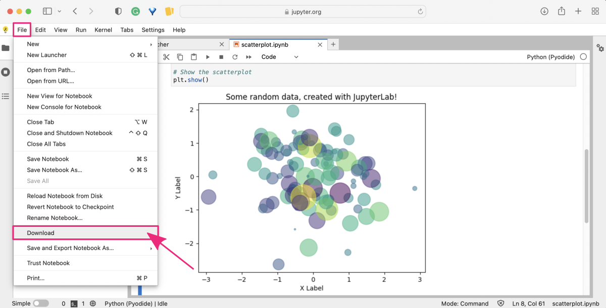

---

# *Google Colab* **online**

<a href="https://colab.research.google.com" target="_blank">Google Colab  ⤴</a> (short for <i>research colaboratory</i>) is a **cloud-based service** provided by Google that allows users **to create, run, and share interactive Jupyter notebooks without the need to install** any software on their computer.

<b>Google Colab uses Python 3</b> as its default programming language. Specifically, it uses the Anaconda distribution of Python, which includes many popular Python libraries for scientific computing and data analysis. Colab notebooks can also <b>leverage Google's machine learning</b> and data analysis services, such as <a href="https://www.tensorflow.org/" target="_blank">TensorFlow  ⤴</a> and <a href="https://cloud.google.com/bigquery/docs/" target="_blank">BigQuery  ⤴</a>.


<div style="background: #dff5b3; padding: 15px;">
<span style="font-weight:800;">NOTE:</span>
<br><span style="font-style:italic;">
The use of the <a href="https://docs.anaconda.com/anaconda/" target="_blank">Anaconda  ⤴</a> distribution of Python in Google Colab provides a convenient and flexible environment for data analysis and scientific computing, while also allowing users to install and use custom packages as needed. <br><br>
Colab provides access to a <b>high-powered cloud-based computing environment</b>, which can be used to run code that requires more computational resources than a typical laptop or desktop computer can provide.
</span>
</div><br>

## *PROS & CONS*

<span style="font-size: 24px; font-weight: 600; color: #66cb5e; ">✓</span> You can create Jupyter notebooks in a web browser without any installation on your computer. <br>
<span style="font-size: 24px; font-weight: 600; color: #66cb5e; ">✓</span> You can use the Google's high-powered cloud-based computing resources. <i>(limited per user)</i> <br>
<span style="font-size: 24px; font-weight: 600; color: #66cb5e; ">✓</span> A variety of commonly used Python libraries are pre-installed. You can also install custom packages. <br>
<span style="font-size: 24px; font-weight: 600; color: #66cb5e; ">✓</span> It is easy to collaborate simultaneously with others on the same notebook shared via a link. <br>
<span style="font-size: 24px; font-weight: 600; color: #66cb5e; ">✓</span> Colab integrates with other Google services, such as Google Drive to easily store your projects. <br>
<span style="font-size: 24px; font-weight: 600; color: #df0010; ">✗</span> You need a Google account to sign in and use Google Colab. *(<a href="https://accounts.google.com/signup/v2/webcreateaccount?flowName=GlifWebSignIn&flowEntry=SignUp&hl=en" target="_blank">Google account  ⤴</a> is free)* <br>
<span style="font-size: 24px; font-weight: 600; color: #df0010; ">✗</span> Colab sessions may time out after a certain period of inactivity. <br>
<span style="font-size: 24px; font-weight: 600; color: #df0010; ">✗</span> There may be concerns about data security and privacy when working with sensitive data. <br>

## Get started on a platform

**Here's how you can use the platform:**

**1.** Open any web browser and go to the Colaboratory website: <a href="https://colab.research.google.com" target="_blank">https://colab.research.google.com  ⤴</a>

<i>When you open the Google Colab website, you will land on the "Welcome to Colab" page, which provides a quick guide to <b>"What is Colab?"</b> The guide also provides a <b>sample code snippet</b> to help users get started with running their first Colab notebook. Further, you can find there some information about applications in data science and machine learning studies. Finally, you will get many useful links to in-depth resources for learning more about Colab and how to use it effectively.</i>

<p align="center">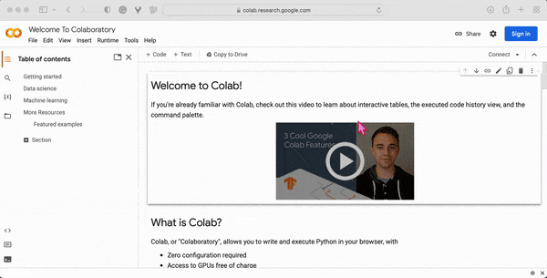</p>

**2.** Click on the `File` button in the top menu bar and then click on the `New Notebook` option, to launch the Colab-Jupyter user interface in your browser. `Sign in` to get access to your Google account.

<p align="center"></p>

Once successfully logged in, the new notebook will appear in your browser tab, and you should be redirected to the URL: <a href="https://colab.research.google.com/drive/" target="_blank">https://colab.research.google.com/drive/  ⤴</a> followed by the random string encoding the address of your new notebook.

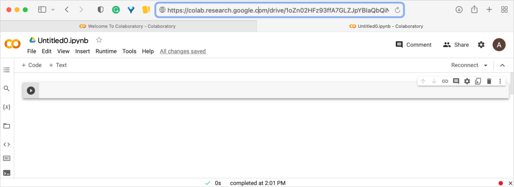

**While Jupyter and Colab share many similarities, there are a few key differences in their user interfaces and workflows.** Colab provides a more convenient way to run cells. Instead of having to use keyboard shortcuts or click a toolbar button, you can simply click the button on the left end of the cell. This button looks like a triangle or a `play` button, and it lets you run the cell with a single click. *It is convenient if you're using Colab on a touch-enabled device.*

Colab provides many other features. Here's the quick look on the **options available in the Colab interface**:

<details><summary><b><i>Expand to learn more:</i></b></summary>

<b>Rename the notebook</b><br>
<i>This option allows you to change the name of your notebook. By default, your notebook will be named "Untitled.ipynb", but you can rename it to something more descriptive by clicking on the current name and typing in a new name.</i> <br><br>
<b>Find and replace</b><br>
<i>This option allows you to search for specific text in your notebook and replace it with something else. You can use this option to quickly make changes to your code, for example, if you need to replace a variable name throughout your notebook.</i> <br><br>
<b>Variable inspector</b><br>
<i>This option allows you to view all the variables that are currently defined in your notebook, along with their values and data types. This can be helpful for debugging your code and understanding how different parts of your notebook are connected.</i> <br><br>
<b>File browser</b><br>
<i>This option provides a file browser for navigating and managing the files in your Google Drive. You can use this option to create new folders, upload and download files, and open notebooks and other files in Google Colab.</i> <br><br>
<b>Code snippets</b><br>
<i>This option provides a collection of pre-written code snippets that you can use as a starting point for your own code. The code snippets are organized by topic, such as "Data Loading", "Model Training", and "Visualization".</i> <br><br>
<b>Commands palette</b><br>
<i>This option allows you to quickly access various commands and features in Google Colab using a search interface. You can use this option to quickly find shortcuts without having to navigate through menus and options.</i> <br><br>
<b>Runtime terminal</b><br>
<i>This option provides a terminal interface that allows you to run commands directly on the underlying operating system of your Google Colab instance. This can be useful for running system commands, installing software, and managing files outside of your notebook. <b>(available only in the ColabPro)</b></i> <br><br>
</details><br>

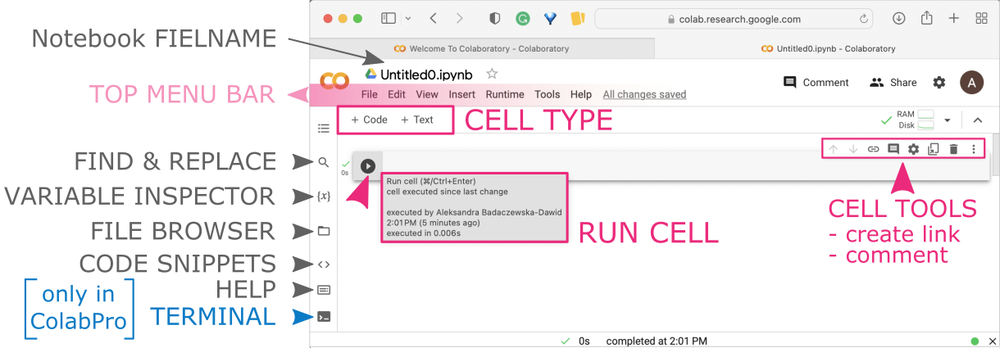


**3.** You can rename the notebook file by clicking on the filename which activates the edit mode. *My notebook is called `scatterplot_seaborn.ipynb`.*

You can now start writing Python code in the notebook cells. Run your code by clicking on the `Run` button next to the cell or pressing `Ctrl + Enter` *(while having cursor within a cell)*.

## Python coding example <br> <i>- scatterplot by <b>seaborn</b></i>

**4. Example Python-based notebook for creating scatterplot using seaborn.**

<i>In this example, we use a ready-made <b>Wine dataset</b> loaded from the `sklearn` library. Then we will use a `seaborn` functions to plot some dataset characteristics as a 2-dimensional scatterplot with a third parameter determining the color of points.</i>

<div style="background: #dff5b3; padding: 15px;">
<span style="font-weight:800;">NOTE:</span>
<br><span style="font-style:italic;">
<a href="https://scikit-learn.org/stable/" target="_blank">Scikit-learn  ⤴</a> is a a Python machine learning library that provides tools for data mining, data analysis, and machine learning tasks. It includes example datasets, for example <a href="https://scikit-learn.org/stable/modules/generated/sklearn.datasets.load_wine.html" target="_blank">Wine dataset  ⤴</a> that contains the results of a chemical analysis of wines grown in the same region in Italy by three different cultivators. The dataset has 178 samples and 13 features. <br><br>
<a href="https://seaborn.pydata.org/" target="_blank">Seaborn  ⤴</a> is a Python data visualization library based on Matplotlib that provides a high-level interface for creating informative and attractive statistical graphics. <br><br>
<a href="https://pandas.pydata.org/" target="_blank">Pandas  ⤴</a> is a Python data manipulation library that provides data structures for efficiently storing and manipulating large datasets, and tools for cleaning, filtering, and transforming data.
</span>
</div><br>

All libraries are included within the Google Colab development environment, so no installations are required.

<div style="background: #cff4fc; padding: 15px;">
<span style="font-weight:800;">PRO TIP:</span><br>
When running code in Colab, you may encounter an error message that indicates that a library is not available: "ModuleNotFoundError: No module named XXX". <br>
To install a library that is not available in Colab, you can use the <b>!pip install</b> command:
<code style="background-color: #e4f0f0; padding: 10px 10px; width:100%; display: block; margin-top: 10px; font-size:0.8em;">
!pip install library_name
</code><br>
This will install the library in your Colab environment, and then you should import it in your code:
<code style="background-color: #e4f0f0; padding: 10px 10px; width:100%; display: block; margin-top: 10px; font-size:0.8em;">
import library_name
</code>
</div><br>

**STEP A: Add a markdown cell in the notebook providing the introduction to your project.**

<i>Hover the mouse over the top edge of the <b>code cell</b> to display buttons for adding an additional <b>text cell</b> above.</i>

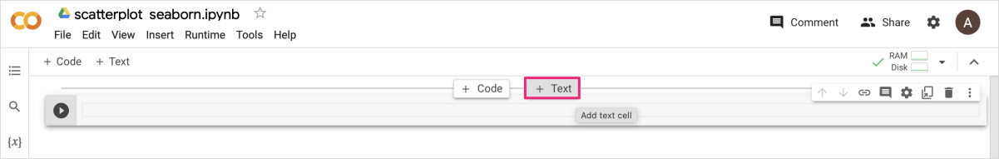

*You can copy the text provided below and paste it into the new text cell in the notebook.*

<div style="background: #e8e9e8; padding: 15px;">
# Exploring Wine Dataset using Seaborn <br><br>

This project demonstrates how to load and explore the ***Wine dataset*** from Scikit-learn using Pandas, and how to explore the relationship between the features of the dataset using Seaborn plotting functions. <br><br>

* First, we'll load the dataset using the `load_wine()` function from the `sklearn.datasets` module. <br>
* We'll then convert the dataset to a **Pandas** `DataFrame` to make it easier to work with. <br>
* Next, we'll create a **scatter plot** comparing the "alcohol" and "color_intensity" features of the dataset using the `scatterplot()` function from the **Seaborn** library.
</div><br>

*After pasting the text, you will see the editing interface on the left and a preview of the rendered markdown on the right. You can customize the formatting to your liking.*

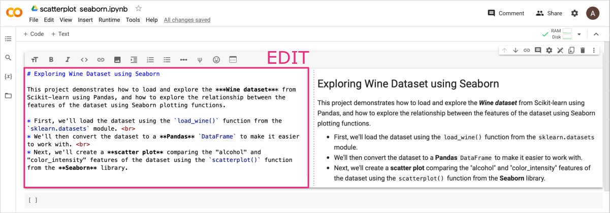

<div style="background: #cff4fc; padding: 15px;">
<span style="font-weight:800;">PRO TIP:</span>
<br><span style="font-style:italic;">
To learn more about Markdown syntax and benefits, check out the practical tutorial <a href="https://datascience.101workbook.org/09-ProjectManagement/02-DOCUMENTATION/02-intro-to-markdown" target="_blank">Introduction to Markdown  ⤴</a> in Section <a href="https://datascience.101workbook.org/09-ProjectManagement/02-DOCUMENTATION/01-documentation-improvement-tools" target="_blank">09. Project Management : Documentation Improvement Tools  ⤴</a>. It will provide you with a hands-on experience of using Markdown to format text, add images, create lists, and more. Don't miss out on this opportunity to enhance your skills!
</span>
</div><br>

To render the **text cell** press `Shift + Enter`. <br>
*This will render the markdown content and move your cursor to the cell below.*

**STEP B: Add a code cell to import required modules.**

In the next **code cell** add Python code for all required imports, i.e., `pandas`, `seaborn`, and wine dataset from the `sklearn`.

```
# import libraries and load the dataset
import pandas as pd                       # to manage data structure
import seaborn as sns                     # to create scatterplot
from sklearn.datasets import load_wine    # to load the ready-made dataset
```

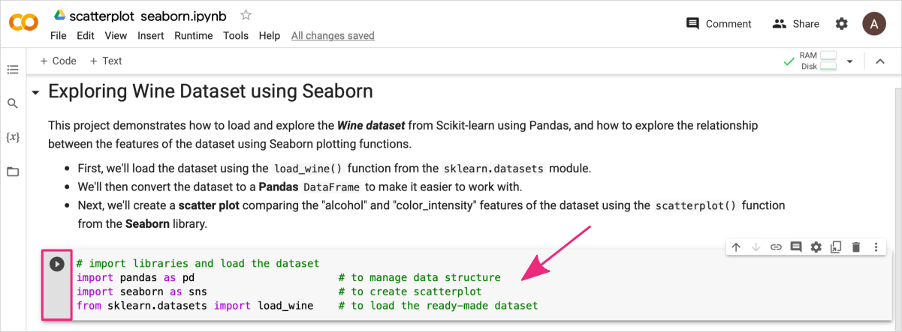

To execute the code cell, press `Shift + Enter` or click the `Run` button.

**STEP C: Add a code cell to create the python code for loading the dataset.**

Add next `code cell`, and copy-paste Python code for loading the dataset and exploring its contents.

```
#1 Load the Wine dataset
wine_data = load_wine()

#2 Preview dataset structured
# print(wine_data.DESCR)                            # optional: uncomment this line to see the dataset description
print(f'KEYS: {list(wine_data.keys())}\n')          # optional
print(f'TARGETS: {wine_data.target_names}\n')       # optional
print(f'FEATURES: {wine_data.feature_names}\n')     # optional

#3 Convert the dataset to a Pandas DataFrame
df = pd.DataFrame(wine_data.data, columns=wine_data.feature_names)
df['target'] = wine_data.target
print(f'DATAFRAME:\n{df.head()}')                   # optional
```

<details><summary><i><b>What the script does?</b></i></summary>

<b>#1 Load the Wine dataset</b><br>
First, we call <b>load_wine()</b> function imported from the sklearn.datasets module.
<code style="background-color: #e4f0f0; padding: 10px 10px; width:100%; display: block; margin-top: 10px; font-size:0.8em;">
wine_data = load_wine()
</code>
This loads the wine dataset as a Python object of a <i>dictionary</i> type.
<br><br>
<b>#2 Preview dataset structured</b><br>
Then, using a <b>print()</b> function, we can preview, what is the structure of the dataset and how to extract the information we need. The dictionary object in Python has a built-in method <b>dict.keys()</b> that returns the list of the keys available in the dictionary.
<code style="background-color: #e4f0f0; padding: 10px 10px; width:100%; display: block; margin-top: 10px; font-size:0.8em;">
print(f'KEYS: {list(wine_data.keys())}\n')
</code>
In this case, we receive the following keys:
<code style="background-color: #e8e9e8; padding: 10px 10px; width:100%; display: block; margin-top: 10px; font-size:0.8em;">
['data', 'target', 'frame', 'target_names', 'DESCR', 'feature_names']
</code>
The value corresponding to each key can be previewed as an attribute of the dictionary object, i.e., dict.attribute:
<code style="background-color: #e4f0f0; padding: 10px 10px; width:100%; display: block; margin-top: 10px; font-size:0.8em;">
wine_data.DESCR &emsp; &emsp; &emsp; &emsp; &emsp; # returns decription of the dataset<br>
wine_data.feature_names &emsp; # returns names of the measured features
</code><br>
<b>#3 Convert the dataset to a Pandas DataFrame</b><br>
Once you know what is in the dataset, you can create a well-structured Pandas DataFrame object containing the information you need. In this case, we build the DataFrame using information from the "data" field with column headers from the "feature_names" field.
<code style="background-color: #e4f0f0; padding: 10px 10px; width:100%; display: block; margin-top: 10px; font-size:0.8em;">
df = pd.DataFrame(wine_data.data, columns=wine_data.feature_names)
</code>
We also want to know to which target class the observations belong so we add an additional column to the DataFrame we created in a previous step:
<code style="background-color: #e4f0f0; padding: 10px 10px; width:100%; display: block; margin-top: 10px; font-size:0.8em;">
df['target'] = wine_data.target
</code>
Now, we can use a structured form of the dataset to create plots.
</details><br>

To execute the code cell, press `Shift + Enter` or click the `Run` button.

<div style="background: mistyrose; padding: 15px; margin-bottom: 20px;">
<span style="font-weight:800;">WARNING:</span>
<br><span style="font-style:italic;">
Note that in Colab, the result of procedures performed in a cell with a code is displayed just below but within the same cell. <br>
In the Jupyter interface, the output appears as a separate next cell.
</span>
</div><br>

Just below the code snippet in your notebook, you should see the output of the `print()` function:

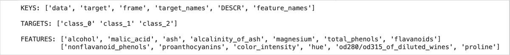

*This part of the output shows the structure of the wine dataset loaded from the sklearn library. It is a dictionary with 6 key:value elements. The wines are classified to 3 target categories. For all wines were collected 13 different measurements, i.e., features.*

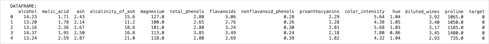

*This part of the output shows the structure of dataset transformed to the DataFrame object. The first 5 samples of the Wine dataset is displayed, which include the names of the features and their corresponding values.*


**STEP D: Add a code cell to create the scatterplot using seaborn.**

Add next `code cell`, and copy-paste Python code to create a scatter plot comparing the <i>"alcohol"</i> and <i>"color_intensity"</i> features of the dataset.

```
# Plot a scatterplot of alcohol vs. color_intensity
sns.set(rc={'figure.figsize':(6,3), 'figure.dpi': 200})         # set the graph size and resolution
sns.scatterplot(data=df, x="alcohol", y="color_intensity", hue="target", size=80)
```

<details><summary><i><b>What the script does?</b></i></summary>

<b># Configure a graph settings</b><br>
Seaborn's <b>sns.set()</b> function is used to customize the appearance of plots created using Seaborn. It can be used to change the default settings for font size, color palettes, plot styles, and more. The <b>rc</b> parameter in Seaborn's sns.set() function allows you to specify values for Matplotlib's runtime configuration parameters. These parameters control a wide variety of aspects of the plot, including the figure size (<i>'figure.figsize'</i>), resolution (<i>'figure.dpi'</i>), font size (<i>'font.size'</i>), axes (<i>'axes.labelsize'</i>, <i>'axes.titlesize'</i>), line styles (<i>'lines.linewidth'</i>, <i>'lines.linestyle'</i>), and more.
<code style="background-color: #e4f0f0; padding: 10px 10px; width:100%; display: block; margin-top: 10px; font-size:0.8em;">
sns.set(rc={'figure.figsize':(6,3), 'figure.dpi': 200})
</code><br>
Here are some of the available options for sns.set():
<li><b>palette='deep'</b> sets the color palette for the plot; options: <i>'deep', 'muted', 'pastel', 'bright', 'dark', and 'colorblind'</i></li>
<li><b>style='darkgrid'</b> sets the overall style of the plot; options: <i>'ticks', 'darkgrid', 'whitegrid', 'dark', and 'white'</i></li>
<li><b>font='sans-serif'</b> a dictionary specifying the font properties</li>
<li><b>context='poster'</b> a string specifying the context in which the plot will be displayed; options: <i>'paper', 'notebook', 'talk', 'poster'</i></li>
<br>
<b># Plot using seaborn graphs</b><br>
Seaborn provides a wide range of plot types for visualizing statistical data, including:<br> <i>'scatterplot', 'lineplot', 'histplot', 'kdeplot', 'rugplot', 'jointplot', 'pairplot', 'heatmap', 'clustermap', 'boxplot', 'violinplot', 'barplot', 'countplot', 'relplot'</i>.<br>
These plot types are similar to those available in Matplotlib, but Seaborn provides several additional types of plots and additional functionality for customizing the visual style of the plots.
<code style="background-color: #e4f0f0; padding: 10px 10px; width:100%; display: block; margin-top: 10px; font-size:0.8em;">
sns.scatterplot(data=df, x="alcohol", y="color_intensity", hue="target", size=80)
</code><br>
The <b>scatterplot() function</b> in Seaborn is used to draw a scatter plot of two variables with possible semantic grouping. Here are some of the options available for customizing the scatter plot in Seaborn:
<li><b>x, y</b> : variables to be plotted on the x and y axes</li>
<li><b>data</b> : DataFrame or array containing the data to be plotted</li>
<li><b>hue</b> : variable used to group the data by color; <i>this can be a categorical or numeric variable</i></li>
<li><b>markers</b> : set of marker styles to use for the style variable</li>
<li><b>size</b> : variable used to set the size of the markers; <i>this can be a numeric variable or a categorical variable with a specified mapping of size values</i></li>
<li><b>sizes</b> : minimum and maximum sizes to use for the markers</li>
<li><b>style</b> : ariable used to set the marker style; <i>this can be a categorical variable with a specified mapping of marker styles</i></li>
<li><b>palette</b> : color palette to use for coloring the markers based on the hue variable</li>
<li><b>alpha</b> : transparency of the markers</li>
<li><b>edgecolor</b> : color of the marker edges</li>
<li><b>linewidth</b> : width of the marker edges</li>
<li><b>ax</b> : the matplotlib Axes object to draw the plot onto</li>
</details><br>

To execute the code cell, press `Shift + Enter` or click the `Run` button.

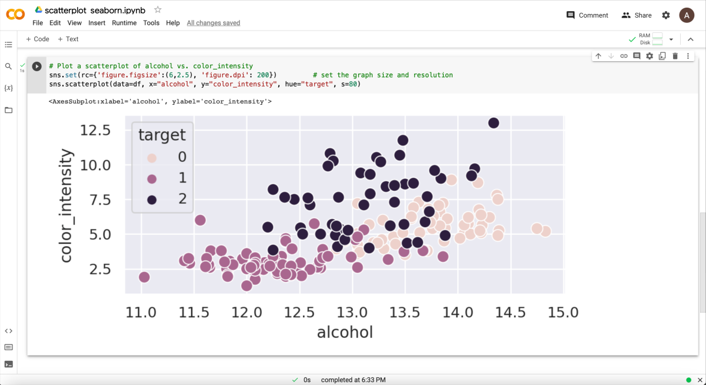


___
# Further Reading
* [2.3 Python Setup on your computing machine](02A-python-setup-locally.md) <i style="color: #a9bbd1;">(installation needed)</i>
  * [2.3.1 Shell & IDLE: create Python code in a terminal or simple IDE](02B-python-terminal-shell.md)
  * [2.3.2 Text editors: create Python code in terminal text files](02C-python-text-editor.md)
  * [2.3.3 Jupyter Lab: create an interactive Python notebook](02D-python-jupyter-notebook.md)
  * [2.3.4 PyCharm: IDE for Professional Python Developers](02E-python-pycharm-ide.md)


  * [3. R programming environment(s)](03-r-programming-environment.md)

___

[Homepage](../index.md){: .btn  .btn--primary}
[Section Index](00-DevelopmentEnvironment-LandingPage){: .btn  .btn--primary}
[Previous](02A-python-online-console){: .btn  .btn--primary}
[Next](02A-python-setup-locally){: .btn  .btn--primary}
[top of page](#introduction){: .btn  .btn--primary}
