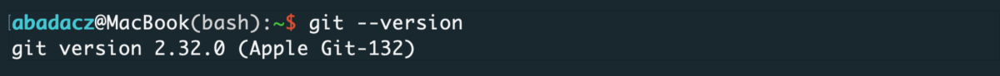
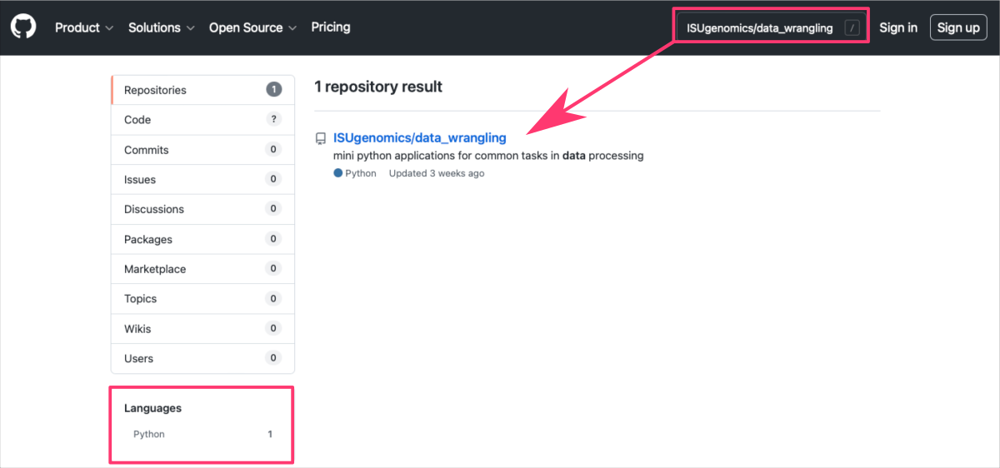
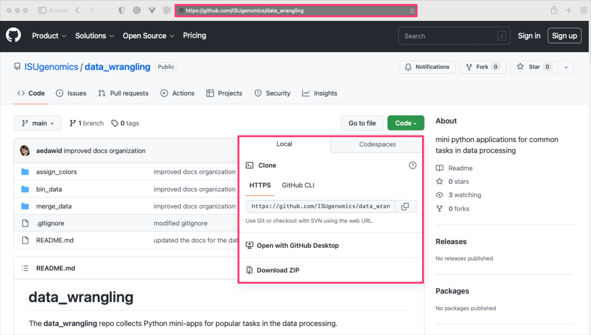
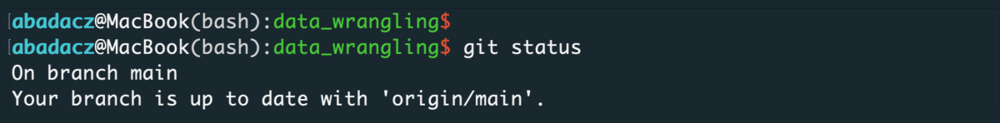



[DataScience Workbook](https://datascience.101workbook.org/) / [07. Data Acquisition and Wrangling](../00-DataParsing-LandingPage.md) / [1. Remote Data Access](01-remote-data-access.md) / [1.2 Remote Data Download](03-0-remote-data-download.md) / **1.2.3 Downloading Online GitHub Repos using GIT**

---


# Introduction

**<a href="https://git-scm.com" target="_blank">Git  ⤴</a> is a free and open source distributed version control system** that allows you to manage various repositories and collaborate with other people on a project. Online repositories have long ceased to be dedicated only to code development. Now, you can create or **download a variety of different types of repositories**, including:

* standalone software and libraries
* web developments: websites, web servers, web applications
* data science projects: workflows, pipelines, datasets, and databases
* configuration files
* documentation and tutorials
* books and personal notebooks

In general, online repositories can be used for any type of project that involves multiple files that change over time. Git is a powerful tool that facilitates management and version control of these repositories. In particular, **you can use `git` to download the repository you need**. That's what you will learn in this practical tutorial [ *go to the [hands-on section](#hands-on-tutorial)* ].

To learn more about project storage and version control, explore the <a href="https://datascience.101workbook.org/09-ProjectManagement/01-SOURCE-CODE/01-storage-version-control" target="_blank">09. Project Management: Storage & Version Control  ⤴</a> section in this workbook. Specifically, you can **get started with a few popular online hosting platforms** that allow you to version control using Git:

* <a href="https://datascience.101workbook.org/09-ProjectManagement/01-SOURCE-CODE/03-repo-hosting-platforms" target="_blank">Online Hosting Platforms for GIT Repositories  ⤴</a>
  * <a href="https://datascience.101workbook.org/09-ProjectManagement/01-SOURCE-CODE/04-intro-to-github" target="_blank">Introduction to GitHub  ⤴</a>
  * <a href="https://datascience.101workbook.org/09-ProjectManagement/01-SOURCE-CODE/05-intro-to-bitbucket" target="_blank">Introduction to BitBucket  ⤴</a>

<span style="color: #ff3870;font-weight: 500;">If you are planning to contribute to any repository</span>, it is worthwhile for you to learn more about the useful options offered by `Git`. In this case, use the hands-on tutorials that provide **instructions for more advanced git commands**:

* <a href="https://datascience.101workbook.org/09-ProjectManagement/01-SOURCE-CODE/02A-github-commands" target="_blank">GIT - a distributed version control system  ⤴</a>
  * <a href="https://datascience.101workbook.org/09-ProjectManagement/01-SOURCE-CODE/02B-github-commands" target="_blank">GIT Commands CheatSheet  ⤴</a>
* <a href="https://datascience.101workbook.org/09-ProjectManagement/01-SOURCE-CODE/04A-github-advanced" target="_blank">GitHub for advanced users  ⤴</a>

# Hands-on tutorial

In this tutorial, you will learn how to **download online repositories using the Git command-line interface**. <br>
Whether you are a seasoned developer or just starting out with Git, this tutorial will help you understand the basics of working with Git repositories and provide you with the tools and knowledge you need to effectively manage your code and data. <br>
*You can also follow these instructions if you simply want to download resources from any public repository to use them locally.*

<div style="background: #dff5b3; padding: 15px;">
<span style="font-weight:800;">NOTE:</span>
<br><span style="font-style:italic;">
<a href="https://git-scm.com" target="_blank">Git  ⤴</a> is a popular and powerful version control system that is widely used for managing software development projects and other types of data. You can use command-line git to download the repository hosted on any remote server, including: <br>
<a href="https://github.com" target="_blank">GitHub  ⤴</a>, <a href="https://bitbucket.org" target="_blank">Bitbucket  ⤴</a>, <a href="https://gitlab.com" target="_blank">GitLab  ⤴</a>, <a href="https://sourceforge.net" target="_blank">SourceForge  ⤴</a>, <a href="https://www.gitkraken.com" target="_blank">GitKraken  ⤴</a>.
</span>
</div>


## 1. Install Git

First, make sure you have Git installed on your computer. The easiest way is to check the installed version of git:

```
git --version
```



**If you see a similar output on the screen, you have already everything you need. Skip to step [2. Clone the repository](#2-clone-the-repository).**

In case `git` is not installed on your machine, an error message will appear on the screen: `git: command not found`. Then, you need to install `git` manually. Follow the instructions given for the specific operating system:

**Linux** <br>
The easiest way to install Git on Linux is through your distribution's package manager. Here are the steps to install Git on some of the most popular Linux distributions. *Copy-paste commands to your terminal window.*

<details><summary>Ubuntu/Debian:</summary>

<code style="background-color: #e4f0f0; padding: 10px 10px; width:100%; display: block; margin-top: 10px;">
sudo apt-get update <br>
sudo apt-get install git
</code><br>
</details>

<details><summary>Fedora:</summary>

<code style="background-color: #e4f0f0; padding: 10px 10px; width:100%; display: block; margin-top: 10px;">
sudo dnf update <br>
sudo dnf install git
</code><br>
</details>

<details><summary>CentOS:</summary>

<code style="background-color: #e4f0f0; padding: 10px 10px; width:100%; display: block; margin-top: 10px;">
sudo yum update <br>
sudo yum install git
</code><br>
</details><br>

For more information, please see the official Git documentation: <a href="https://git-scm.com/book/en/v2/Getting-Started-Installing-Git" target="_blank">https://git-scm.com/book/en/v2/Getting-Started-Installing-Git ⤴</a>


**MacOS** <br>
There are a few ways to install Git on MacOS, including using:

<details><summary><b>A.</b> the Homebrew package manager</summary>

<i>Install <a href="https://brew.sh/" target="_blank">homebrew  ⤴</a>
 if you don't already have it, then:</i>
<code style="background-color: #e4f0f0; padding: 10px 10px; width:100%; display: block; margin-top: 10px;">
brew update <br>
brew install git
</code><br>
</details>

<details><summary><b>B.</b> the MacPorts software package</summary>

<i>Install <a href="https://www.macports.org/" target="_blank">MacPorts  ⤴</a>
 if you don't already have it, then:</i>
<code style="background-color: #e4f0f0; padding: 10px 10px; width:100%; display: block; margin-top: 10px;">
sudo port install git
</code><br>
</details><br>


For more information, please see the official Git documentation: <a href="https://git-scm.com/download/mac" target="_blank">https://git-scm.com/download/mac</a>


**Windows** <br>

The easiest way to install Git on Windows is to download the official Git for Windows installer from the Git website: <a href="https://git-scm.com/download/windows" target="_blank">https://git-scm.com/download/windows  ⤴</a>

*Follow the instructions in the installer to complete the installation process. After installation, you can access Git from the Windows command prompt or from Git Bash, which is included with the Git for Windows installation.*

## 2. Clone the repository

Know that you can use a command line Git to **download a repository from any platform that supports Git**, including GitHub, Bitbucket, GitKraken, SourceForge, and others. The command works the same way regardless of the platform you are using. All you need to do is specify the URL of the repository you want to clone, and Git will take care of the rest.

<div style="background: #cff4fc; padding: 15px;">
<span style="font-weight:800;">PRO TIP:</span>
<br><span style="font-style:italic;">
It's worth noting that while Git is a distributed version control system, and you can use it to clone a repository from any Git server, some platforms like <b>GitHub and Bitbucket offer additional features and services that are specifically designed for Git</b>, such as issue tracking, pull requests, and continuous integration and deployment. So, depending on your needs, you may want to consider using a platform like GitHub or Bitbucket for your Git work.
</span>
</div>


### *`git clone`* command

The `git clone` command is one of the most basic and essential Git commands. It allows you to download (or "clone") an entire Git repository from a remote server to your local computer. *This can be useful when you want to start working with an existing project or contribute to an open-source project.*

The basic syntax of the git clone command is as follows:
```
git clone <repository-url>
```

where `<repository-url>` is the URL of the Git repository you want to clone. <br>
*Replace `<repository_url>` with the URL of the repository you want to download.*


### *Example: download from GitHub*

For example, let's clone the Git repository hosted at <a href="https://github.com" target="_blank">GitHub  ⤴</a>.

Open any web browser and navigate to <a href="https://github.com" target="_blank">https://github.com  ⤴</a>.


Use the searching key `ISUgenomics/data_wrangling` in the upper right corner to find a **data_wrangling** repository.



When you land on the target repository page, you can:
* copy the URL from the browser address box on the top of the page
or
* click on the green `code` button. This will display the dialog box from which you can also copy the correct URL for the repo.



Open your terminal or command prompt and navigate to the directory where you want to store the repository. Then, run the `git clone` command followed by the copied URL:

```
git clone https://github.com/ISUgenomics/data_wrangling.git
```


After the repository is cloned, check it. Navigate into the repository's directory using `cd` command:

```
cd data_wrangling
```


**That's it!** You now have a local copy of the remote repository and can start using it (e.g., analyzing data, running software, reading docs). If you are planning to become a contributor to the repository, start making changes, committing your work, and pushing your changes back to the remote server.

For example, you can run:
* `git log` to see a list of all the commits made to the repository
* `git status` to see a list of local changes which are not yet sent to the online repository



Also, you can also use the `git status` command to check the current branch, as it will show you the branch you are currently on in the output.

<div style="background: mistyrose; padding: 15px; margin-bottom: 20px;">
<span style="font-weight:800;">WARNING:</span>
<br><span style="font-style:italic;">
When cloning a repository, Git automatically creates a remote named 'origin' that points to the URL you cloned from. You can interact with the remote using Git commands such as: <br>
<li><b>git pull</b> - to download changes from a remote Git repository to your local machine</li>
<li><b>git add</b> - to add files to the staging area, which is where you prepare changes to be committed to the Git repository,</li>
<li><b>git commit</b> - to create a new commit in the Git repository, which is a snapshot of the current state of the code,</li>
<li><b>git push</b> - to upload changes from your local machine to a remote Git repository</li>
</span>
</div>

If you are planning to contribute to any GIT-based repository, it is worthwhile for you to learn more about the useful options offered by git. In this case, use the hands-on tutorials that provide **instructions for more advanced git commands**:

* <a href="https://datascience.101workbook.org/09-ProjectManagement/01-SOURCE-CODE/02-intro-to-git" target="_blank">GIT - a distributed version control system  ⤴</a>
  * <a href="https://datascience.101workbook.org/09-ProjectManagement/01-SOURCE-CODE/02A-git-cheatsheet" target="_blank">GIT Commands CheatSheet  ⤴</a>

___
# Further Reading
* [1.2.4 Downloading Single Folder from GitHub using SVN](03-4-tutorial-download-github-folders-svn)

* [1.3 Remote Data Preview without Downloading](04-0-remote-data-preview)

* [2. Data Manipulation](../02-DATA-MANIPULATION/01-data-manipulation)
* [3. Data Wrangling: ready-made apps](../03-DATA-WRANGLING-APPS/00-data-wrangling-apps)


___

[Homepage](../../index.md){: .btn  .btn--primary}
[Section Index](../00-DataParsing-LandingPage){: .btn  .btn--primary}
[Previous](03-2-tutorial-download-web-scraping){: .btn  .btn--primary}
[Next](03-4-tutorial-download-github-folders-svn){: .btn  .btn--primary}
[top of page](#introduction){: .btn  .btn--primary}
