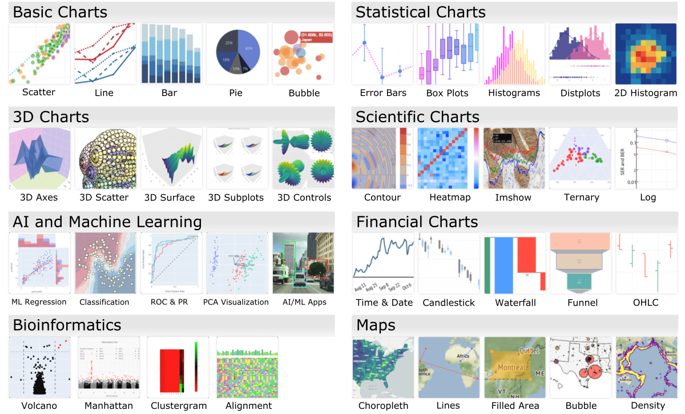
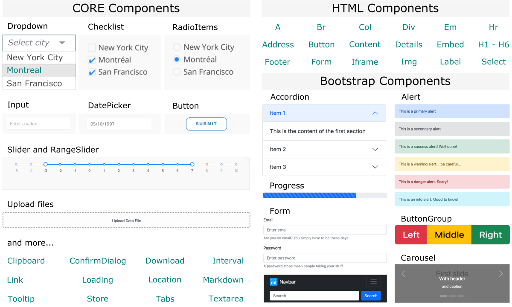




[DataScience Workbook](https://datascience.101workbook.org/) / [08. Data Visualization](../../00-DataVisualization-LandingPage.md) / [2. Introduction to Scientific Graphing](../01-introduction-to-scientific-graphing.md) / **2.2 Plotly-Dash – Data Processing & Interactive Plotting with Python**

---

## Introduction

Python is a popular programming language that is widely used for data analysis and scientific computing. One of the key features of Python is the ability to create interactive graphs using libraries such as Plotly and Dash. These libraries can be used to create interactive graphs and web applications for data visualization. The Plotly library is built on top of Plotly.js, and allows users to create a range of interactive graphs. Dash is a web app framework that allows users to build interactive web apps using Python and Dash HTML Components.

Using Plotly and Dash together, users can create engaging, informative, and highly interactive graphs and web applications that can be used to explore and analyze data on-the-fly. This can be useful for data scientists, researchers, and analysts who want to share their findings with others in a visually appealing and intuitive way.

## Plotly-Dash Graphing Library

[Plotly](https://plotly.com) is a modern and extensively developing library for **interactive graphing**. It is an open-source project that provides compatibility with the most popular programming languages, such as **Python**, **R**, **Julia**, **Javascript**, **F#**, **ggplot2**, and **MATLAB**. All variants have detailed documentation and separate [GitHub repositories](https://github.com/orgs/plotly/repositories) with issues tracking and opportunity for contribution.
The **Plotly** library allows users to create a wide range of interactive graphs, including scatter plots, bar charts, heatmaps, and customized arrangements of them. The library is built on the JavaScript plotting library, Plotly.js, and is highly customizable, allowing users to specify the appearance and behavior of their graphs.

More so, the Plotly team developed also an open-source analytical web app framework, [Dash](https://plotly.com/dash/), which allows users to build interactive web applications for data visualization. Dash apps are built using Python engine, and the app's user interface is defined using various Dash Components: [core](https://dash.plotly.com/dash-core-components), [HTML](https://dash.plotly.com/dash-html-components), and [bootstrap](https://dash-bootstrap-components.opensource.faculty.ai/docs/quickstart/). So, you can effortlessly add many different widgets such as dropdowns, buttons, sliders, and dialog boxes to support application management and user-triggered on-the-fly chart customization.

That is a total game-changer in developing interactive web applications and data visualization!

### Types of Plotly charts

The **Plotly** library offers many types of interactive charts. The image below shows just a few examples from a vast set that is constantly growing. So if you've been inspired, you'll learn more about the Plotly library and get hands-on experience using it in the **Python** coding variant by exploring the following article, [Introduction to Plotly](02-intro-to-plotly-graphs).

 
**Figure 1.** *The categorized examples of Plotly interactive graphs.*

### Types of Dash widgets

The **Dash** library offers many templates for components that facilitate building an interactive web application and user-triggered changes in the Plotly graphs. Both libraries are fully compatible. Dash's main modules include **core components** that allow loading inputs and change chart parameters. There are also **HTML** and **Bootstrap components** that simplify the creation of the page layout and facilitate the implementation of navigation events. Learn more details in the hands-on tutorial on [Introduction to Dash](03-intro-to-dash-widgets).

 
**Figure 2.** *Examples of Dash widgets for interactive web applications, including Core, HTM, and Bootstrap components.*
___
# Further Reading
* [2.2.1 Introduction to Plotly (Python library)](02-intro-to-plotly-graphs)
* [2.2.2 Introduction to Dash (Python library)](03-intro-to-dash-widgets)
* [2.2.3 Plotly Graphing - Interactive Examples in the JupyterLab](04-plotly-examples-in-jupyterlab)

* [2.3 RStudio – Data Processing & Plotting with R](../03-R/01-graphing-with-rstudio)

___

[Homepage](../../../index.md){: .btn  .btn--primary}
[Section Index](../../00-DataVisualization-LandingPage){: .btn  .btn--primary}
[Previous](../01-GNUPLOT/01-gnuplot-basics){: .btn  .btn--primary}
[Next](02-intro-to-plotly-graphs){: .btn  .btn--primary}
[top of page](#introduction){: .btn  .btn--primary}
