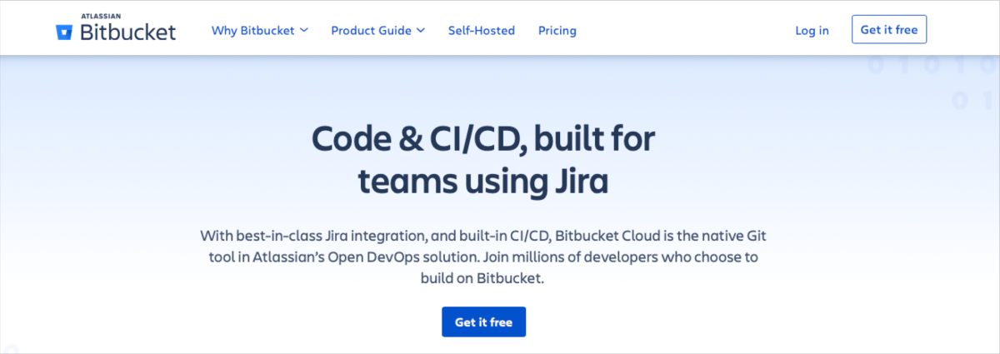



[DataScience Workbook](https://datascience.101workbook.org/) / [09. Project Management](../../00-ProjectManagement-LandingPage.md) / [[3. Resource Management](../00-intro-resource-management) / [3.3. Storage & Version Control](01-storage-version-control.md) / **3.3.2 Online Hosting Platforms for GIT Repositories**

---

# Introduction

**GIT repositories** are centralized locations where developers store and manage their source code and related files, enabling version control, collaboration, and tracking of changes over time. Repositories are typically stored locally on a developer's machine and **can be synchronized with remote servers or online hosting platforms**.

PRO TIP:
 
Git repositories do NOT have to be hosted on online platforms. Git is a distributed version control system, which means that a Git repository can be stored and managed locally on a single machine or on a network of machines. However, hosting Git repositories on an online platform provides several benefits.

# Online hosting of Git repos

**Hosting Git repositories on an online platform provide accessibility, backup, and collaboration features**. Web services, such as <a href="https://github.com" target="_blank">GitHub  ⤴</a>, <a href="https://gitlab.com" target="_blank">GitLab  ⤴</a>, or <a href="https://bitbucket.org" target="_blank">Bitbucket  ⤴</a>, offer a web-based interface and server infrastructure to host GIT repositories and provide several benefits. For example, hosting your repository on an online platform makes it easier to collaborate with others, as you can give other people access to your repository and work on it together. Additionally, online platforms provide a backup of your repository in case your local machine fails, which helps to ensure that your content is safe and secure.

Each platform provides its own set of features and tools for working with Git, and the choice of platform often depends on the specific needs of your project and organization. For example, **GitHub and BitBucket are popular choices for open-source projects**, while GitLab and VSTS are more commonly used for enterprise-level projects.

Typically, online hosting platforms provide features like:
* **repo cloning** - *creating a local copy of a Git repository*
* **pull requests** - *proposing locally-made changes to be merged into the main repository*
* **issue tracking** - *keeping a record of tasks, bugs, or feature requests in a structured manner,*
* **code reviews** - *examination of source code by one or more developers to ensure code quality*
* **integration** with other development tools - *enabling streamlined workflows and automation in the development process*

making it convenient for teams to work together, contribute to open-source projects, and maintain a centralized source of truth for their codebase.

### Public vs. Private repository
**Not all repositories in your account need to be public.**  
It depends on the online platform you use and your account type.

<i>For example, in <b>GitHub</b>, you have the option to make repositories <b>public or private</b>. If you have a free account, you can create unlimited public repositories, but you are limited to a certain number of private repositories. If you have a paid account, you can create unlimited private repositories as well. 
Similarly, in <b>GitLab and Bitbucket</b>, you have the option to make repositories public or private. In these platforms, <b>private repositories</b> are usually only available <b>with paid accounts</b>.</i>

## Hosting platforms

The table provides a general overview of a few major online hosting platforms for Git repositories.

| Feature/Platform   | GitHub | GitLab | Bitbucket | SourceForge    |
|--------------------|--------|--------|-----------|----------------|
| Version Control    |  Git   |  Git   |   Git     | Git, Mercurial |
| Collaboration      |  Yes   |  Yes   |   Yes     | Yes            |
| Issue Tracking     |  Yes   |  Yes   |   Yes     | Yes            |
| Pull Requests      |  Yes   |  Yes   |   Yes     | No             |
| Code Reviews       |  Yes   |  Yes   |   Yes     | No             |
| CI/CD Integration  |  Yes   |  Yes   |   Yes     | Limited        |
| Project Management |  Yes   |  Yes   |   Yes     | No             |
| Hosting            |Cloud, On-prem|Cloud, On-prem|Cloud, On-prem|Cloud |
|Public Repositories |Unlimited|Unlimited|Unlimited| Unlimited      |
|Private Repositories|Limited | Unlimited|Limited  | Unlimited      |
| Pricing            |Freemium, Paid|Freemium, Paid|Freemium, Paid|Free, Paid|

^ `On-prem hosting` *short for on-premises hosting, refers to the deployment of the hosting platform on the organization's own infrastructure or servers.*  
^ `Freemium pricing` *is a business model where the core features of a product or service are provided for free, while advanced or premium features require a paid subscription.*  
^ `CI/CD integration` *short for Continuous Integration and Continuous Deployment/Delivery, refers to the seamless integration and automation of the software development process, from code changes to deployment.*

---

`GitHub` and `Bitbucket` are two of the most popular online hosting platforms for research projects. Both platforms offer robust version control systems, collaborative features, and integration options that make them ideal for hosting and managing code related to research. Researchers can easily share, collaborate, and track changes in their code repositories, enabling seamless collaboration within research teams.
*  **[GitHub ⤵](#github)**, known for its extensive user base and vast open-source community, provides a wide range of features such as issue tracking and code reviews.

* **[Bitbucket ⤵](#bitbucket)** offers similar functionality with the added flexibility of self-hosting options, making it suitable for research projects with specific security or privacy requirements.

### ***GitHub***

<a href="https://github.com" target="_blank">GitHub  ⤴</a> is a web-based platform that provides hosting for Git repositories. It allows you to **create public or private repositories**, collaborate with other people on a project, and track changes over time. GitHub is **widely used by developers and organizations** to manage their code and is one of the most popular Git hosting services available.

Learn more from the <b>hands-on tutorial</b> <a href="https://datascience.101workbook.org/09-ProjectManagement/01-SOURCE-CODE/04-intro-to-github" target="_blank">Introduction to GitHub  ⤴</a>, provided in this section of the workbook.
  

### ***Bitbucket***

<a href="https://bitbucket.org" target="_blank">Bitbucket  ⤴</a> is a code hosting service that **supports multiple version control systems**, including both Git and Mercurial. It provides a range of tools for managing teams and projects, including permissions management, role-based access control, support for large files & binary files, and collaboration features. Bitbucket is **part of the Atlassian suite of tools**, and it integrates well with other Atlassian products such as <a href="https://www.atlassian.com/software/jira" target="_blank">Jira  ⤴</a> *(issue tracking tool)* and <a href="https://www.atlassian.com/software/confluence" target="_blank">Confluence  ⤴</a> *(collaboration and documentation platform)*.

Learn more from the <b>hands-on tutorial</b> <a href="https://datascience.101workbook.org/09-ProjectManagement/01-SOURCE-CODE/05-intro-to-bitbucket" target="_blank">Introduction to BitBucket  ⤴</a>, provided in this section of the workbook.
  

### *GitLab*

<a href="https://gitlab.com" target="_blank">GitLab  ⤴</a> is another web-based platform for hosting Git repositories. It provides similar features to GitHub and is popular for its integration with Continuous Integration/Continuous Deployment (CI/CD) pipelines.

### *SourceForge*

<a href="https://sourceforge.net" target="_blank">SourceForge  ⤴</a> is a web-based platform that provides hosting for Git and other types of version control systems. It is **popular among open-source projects** and provides a variety of tools for project management and collaboration, with a focus on community support. SourceForge **supports a wide range of programming languages**, including C/C++, Java, Python, and more.

### *GitKraken*

<a href="https://www.gitkraken.com" target="_blank">GitKraken  ⤴</a> is a Git client that **provides a graphical user interface** for working with Git repositories. It integrates with a variety of Git hosting services and provides features for collaboration, code review, and project management.

### *Visual Studio Team Services*

<a href="https://visualstudio.microsoft.com/team-services/" target="_blank">Visual Studio Team Services (VSTS)  ⤴</a> is a cloud-based development platform **provided by Microsoft**. It provides Git version control, continuous integration, and a variety of other tools for software development teams.

### *AWS CodeCommit*

<a href="https://docs.aws.amazon.com/codecommit/latest/userguide/welcome.html" target="_blank">AWS CodeCommit  ⤴</a> is a Git-based source control service that is **part of the Amazon Web Services** (AWS) cloud platform. It provides a secure, scalable, and managed solution for version control that integrates with other AWS services.

___
# Further Reading
* [Introduction to GitHub](04-intro-to-github)
* [GitHub for advanced users](04A-github-advanced)
* [Introduction to BitBucket](05-intro-to-bitbucket)

* [3.4 Documentation Improvement Tools](../02-DOCUMENTATION/01-documentation-improvement-tools)

* [4. Quality Assurance](../../03-PRODUCTIVITY/00-quality-assurance)
* [5. Project Closing](../../04-PUBLICATION/01-project-closing)

___

[Homepage](../../../index.md){: .btn  .btn--primary}
[Section Index](../../00-ProjectManagement-LandingPage){: .btn  .btn--primary}
[Previous](02A-git-cheatsheet){: .btn  .btn--primary}
[Next](04-intro-to-github){: .btn  .btn--primary}
[top of page](#introduction){: .btn  .btn--primary}
