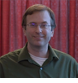

### Andrew Severin

{: .align-left}
His PhD was in Biophysics/NMR spectroscopy. He did a Bioinformatics Postdoc in Soybean genetics and now runs the Genome Informatics Facility at Iowa State University.

### Arun S. Seetharam

{: .align-left}
My main interests are in the fields of bioinformatics and evolutionary genomics. Currently, I am working on various projects involving next-generation sequencing including the first de novo assembly of a teosinte genome. I am also developing pipelines to streamline the assembly and annotation process for newly sequenced organisms. My long-term goal is to study the genome organization and evolution of grass species.

### Aleksandra Badaczewska

{: .align-left}
Alex is a Research Scientist IV at the Genome Informatics Facility at Iowa State University. Her academic background is in Chemistry and Biotechnology, with a Ph.D. in Computational Biology and broad experience in programming and designing web applications. She develops a comprehensive collection of highly customizable visualization solutions for bioinformatics and geospatial analyses.
