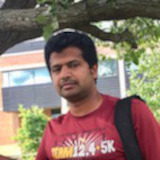
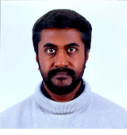

### Andrew Severin

{: .align-left}
Andrew manages the Genome Informatics Facility at Iowa State University. His academic background is in biochemistry with a Ph.D. in Biophysics/NMR Spectroscopy. He is an interdisciplinary scientist working at the interface of Genetics and Bioinformatics, translating Big Data into informative data for interesting biological questions. He is passionate about evolution and the science behind the genome.

### Aleksandra Badaczewska

{: .align-left}
Alex is a Research Scientist IV at the Genome Informatics Facility at Iowa State University. Her academic background is in Chemistry and Biotechnology, with a Ph.D. in Computational Biology and broad experience in programming and designing web applications. She develops a comprehensive collection of highly customizable visualization solutions for Bioinformatics and supports software optimization for the USDA Geospatial analyses.
 

### Siva Chudalayandi

{: .align-left}
I am a Ph.D. in Molecular Biology and Biotechnology with broad expertise is in the field of Genetics and Computational Biology. As an Associate Scientist at the Genome Informatics Facility, I work as a bioinformatics liaison for the USDA community, contribute to tutorials & workshops, and manage online discussions. I also collaborate with researchers in my capacity as computational biologist to perform data-driven discovery.

### Rick Masonbrink

{: .align-left}
I work on a multitude of projects. Some of them involve: characterizing the genomes of endangered abalone species, assessing the cellular roles of small RNAs in nematodes, creating user-friendly bioinformatics tutorials, assessing transposition in irradiated maize, trans-splicing in nematodes, etc.  With the huge variation of collaborative projects that come into the GIF, the constant influx of novel ideas creates an environment conducive to my development.

### Viswa Satheesh

{: .align-left}
Satheesh is a Research Scientist III at the Genome Informatics Facility at Iowa State University. With a Ph.D. in Molecular Biology and Biotechnology, his expertise lies in the field of plant stress biology and epigenetics, where he has made significant contributions by utilizing large-scale biological data. Currently, apart from analyzing NGS data, he creates data analysis tutorials and workshops for scientists in the USDA.

### Sharu Paul

{: .align-left}
Sharu Paul is a Research Scientist at the Genome Informatics Facility at Iowa State University. His background is in Biotechnology with a Ph.D. in Genetics and Genomics. His research is wide-ranging, covering topics from Single-Cell Analyses to the building of Deep Neural Networks. By employing an extensive range of bioinformatic analyses, he seeks to solve big data problems and contributes to developing workshops and tutorials for USDA scientists.

### Arun S. Seetharam

{: .align-left}
My main interests are in the fields of Bioinformatics and evolutionary Genomics. Currently, I am working on various projects involving next-generation sequencing, including the first *de novo* assembly of a teosinte genome. I am also developing pipelines to streamline the assembly and annotation process for newly sequenced organisms. My long-term goal is to study genome organization and the evolution of grass species.

## Guest Contributors

### Jennifer Chang

{: .align-left}
I am a PhD in Bioinformatics and Computational Biology. I have been programming since 2006 and have an interest in data visualization and software development. My research focus has been on analyzing and merging networks, monitoring the evolution of influenza A viruses in swine, and writing cross-platform pipelines. In 2020, I joined the Genomics Informatics Facility in the hopes of developing interdisciplinary pipelines and tutorials.

### Kerrie Geil

{: .align-left }
Kerrie is an ARS SCINet postdoc in the research group of Dr. Deb Peters in Las Cruces, NM. Her M.S. and Ph.D. degrees are in Atmospheric Sciences and her research background is in climate modeling.
   
