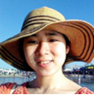

### Andrew Severin

{: .align-left}
Andrew manages the Genome Informatics Facility at Iowa State University. His academic background is in biochemistry with a Ph.D. in Biophysics/NMR spectroscopy. He is an interdisciplinary scientist working at the interface of genetics and bioinformatics. He is passionate about evolution and the science behind the genome.
  

### Siva Chudalayandi

{: .align-left}
My expertise is in the field of molecular biology, genetics and computational biology, modern biological research routinely produce large scale data that aid in shedding light on a phenomena or point us in a newer research direction. As an Associate Scientist at the Genome Informatics Facility, I work as a bioinformatics liaison for the USDA community at large, I contribute to the community by way of tutorials, online discussions etc. I also collaborate with researchers in my capacity as computational biologist to perform data driven discovery.
 

### Aleksandra Badaczewska

{: .align-left}
Alex is a Research Scientist IV at the Genome Informatics Facility at Iowa State University. Her academic background is in Chemistry and Biotechnology, with a Ph.D. in Computational Biology and broad experience in programming and designing web applications. She develops a comprehensive collection of highly customizable visualization solutions for bioinformatics and geospatial analyses.

### Jennifer Chang

{: .align-left}
I am an Iowa State University graduate, with a PhD in Bioinformatics and Computational Biology. I have been programming (in one language or another) since 2006 and have an interest in data visualization and software development. My research focus has been on analyzing and merging networks, monitoring the evolution of influenza A viruses in swine, and writing cross-platform pipelines. In 2020, I joined the Genomics Informatics Facility in the hopes of developing interdisciplinary pipelines and tutorials to meet the needs of the widespread research community.

### Arun S. Seetharam

{: .align-left}
My main interests are in the fields of bioinformatics and evolutionary genomics. Currently, I am working on various projects involving next-generation sequencing including the first de novo assembly of a teosinte genome. I am also developing pipelines to streamline the assembly and annotation process for newly sequenced organisms. My long-term goal is to study the genome organization and evolution of grass species.
